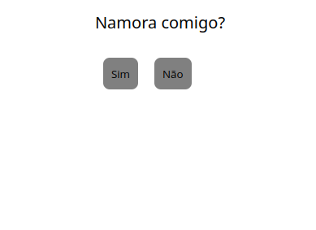

## namora-comigo

  
  



  

## Sobre o Projeto

  

Este projeto consiste em um site simples, criado utilizando HTML, CSS e JS.

O site gera uma "brincadeira", que se torna impossivel clicar no botão não.

  
  

## Como Executar o Projeto

  

Siga os passos abaixo para rodar o projeto na sua máquina:

  

### 1. Clone o repositório

  

```bash

git clone https://github.com/IsaacRogovski/namora-comigo.git

```

  

### 2. Acesse a pasta do projeto

  

```bash

cd namora-comigo

```

  

### 3. Execute o projeto

  

```bash

xdg-open index.html

```

  
  
  

## Tecnologias

  

HTML5
CSS3
JS
  

  

## Autor

  

Isaac Rogovski

[GitHub](https://github.com/IsaacRogovski)